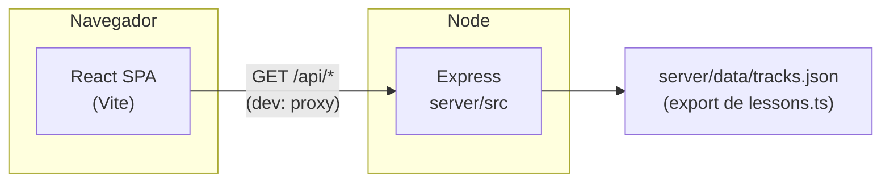

# Code Buddy

Aplicação web para aprender programação em **trilhas** (ex.: Python, JavaScript), com **aulas interativas**, editor de código no browser e feedback por saída esperada. O **frontend** é React + Vite; o **backend** é uma API Node (Express) que serve trilhas e lições em JSON.

---

## Requisitos

| Requisito | Versão / notas |
|-----------|----------------|
| **Node.js** | **20 LTS** ou superior |
| **npm** | Incluído com o Node; na raiz do repo, `npm install` instala frontend e API (workspace `server/`) |

**Navegador:** Chrome, Edge, Firefox ou Safari recentes.

### Variáveis de ambiente (opcional)

| Variável | Onde | Descrição |
|----------|------|------------|
| `PORT` | API | Porta do servidor (predefinido **3001**) |
| `HOST` | API | Interface onde escuta (predefinido **127.0.0.1**, alinhado com o proxy do Vite) |
| `VITE_API_BASE_URL` | Frontend | Só a **origem** da API (ex. `https://api.teudominio.com`), **sem** `/api` no fim. Se acabar em `/api`, o cliente remove para evitar `/api/api/...`. Em dev, vazio + proxy do Vite. |

Copia `.env.example` para `.env` se quiseres documentar valores locais.

---

## Como executar

### Desenvolvimento (frontend + API)

Precisas de **dois terminais** na raiz do repositório:

```bash
npm install
```

**Terminal 1 — API**

```bash
npm run dev:server
```

(Isto corre `npm run export-tracks` antes de subir o Express: gera `server/data/tracks.json` a partir de `src/data/lessons.ts`. Se editares as lições, volta a arrancar a API ou corre `npm run export-tracks` manualmente.)

**Terminal 2 — interface (Vite, porta 8080)**

```bash
npm run dev
```

Abre `http://localhost:8080`. Os pedidos a `/api/*` são enviados para `http://127.0.0.1:3001` (proxy no `vite.config.ts`).

O Vite está com **`strictPort: true`**: a interface usa sempre **8080**. Se aparecer erro de porta ocupada, fecha outro `npm run dev` (ou outro serviço na 8080) ou altera `server.port` em `vite.config.ts`. Sem isto, o Vite costumava subir em **8081** automaticamente e desalinhar do que está no README.

### Endpoints da API

| Método | Caminho | Descrição |
|--------|---------|-----------|
| `GET` | `/api` | Lista de rotas e exemplo para Postman |
| `GET` | `/api/health` | Estado do serviço |
| `GET` | `/api/tracks` | Lista de trilhas |
| `GET` | `/api/tracks/:trackId` | Uma trilha |
| `GET` | `/api/tracks/:trackId/lessons/:lessonId` | Dados da aula (formato esperado pela `LessonPage`) |
| `GET` | `/api/auth/me` | Utilizador da sessão (`{ user }` ou `user: null`) |
| `POST` | `/api/auth/register` | Corpo: `{ email, password, name? }` — cria conta e inicia sessão |
| `POST` | `/api/auth/login` | Corpo: `{ email, password }` |
| `POST` | `/api/auth/logout` | Termina sessão (cookie HTTP-only) |

Contas ficam em `server/data/users.json` (gerado localmente; não commitar dados reais — está no `.gitignore`). Em produção define `SESSION_SECRET` forte.

Os dados vêm de `src/data/lessons.ts`; a API serve uma cópia em JSON (`server/data/tracks.json`), gerada pelo script `npm run export-tracks`.

### Postman (erro “Cannot POST” ou 404)

1. Garante que a API está a correr: `npm run dev:server` (na raiz). Sem isto, o browser ou o Postman não têm servidor na porta **3001**.
2. URL completa com prefixo **`/api`**: `http://127.0.0.1:3001/api/auth/register` (não uses `/auth/register` à raiz).
3. Método **POST**, separador **Body** → **raw** → **JSON**, cabeçalho `Content-Type: application/json`. Corpo mínimo: `{"email":"tu@exemplo.pt","password":"peloMenos8"}`.
4. Para confirmar rotas: **GET** `http://127.0.0.1:3001/api` ou **GET** `http://127.0.0.1:3001/api/health`.

### Outros scripts (frontend)

| Comando | Descrição |
|---------|-----------|
| `npm run build` | Build de produção em `dist/` |
| `npm run preview` | Pré-visualização do build (proxy `/api` para a API em 3001) |
| `npm run lint` | ESLint |
| `npm test` | Vitest |

---

## Linguagens e tecnologias

### Linguagens (código deste repositório)

| Linguagem | Uso |
|-----------|-----|
| **TypeScript** | Frontend (`src/`) e API (`server/src/`) |
| **CSS** | Estilos globais e Tailwind |

### Conteúdo das trilhas

As lições em `src/data/lessons.ts` focam **Python** e **JavaScript** nos exemplos.

### Stack

| Tecnologia | Função |
|------------|--------|
| **React 18** | UI |
| **Vite 5** | Dev server, build e proxy `/api` |
| **Express 4** | API REST |
| **React Router 6** | Rotas da SPA |
| **Tailwind CSS 3** + **shadcn/ui** (Radix) | Estilos e componentes |
| **TanStack Query** | Pedidos à API e cache |
| **Framer Motion** | Animações |
| **tsx** | Executar TypeScript da API em desenvolvimento |

---

## Diagrama (arquitetura)



Fluxo resumido:

1. A SPA pede trilhas/aulas via **`fetch('/api/...')`** (ou `VITE_API_BASE_URL` + `/api/...` em produção).
2. A **API** lê **`server/data/tracks.json`** (gerado a partir de **`src/data/lessons.ts`**) e devolve JSON.
3. **Rotas** da app: `App.tsx`; páginas em `src/pages/`.

---

## Estrutura de pastas (resumo)

```
server/
  src/index.ts      # Express: rotas /api
src/
  App.tsx
  main.tsx
  lib/api.ts        # Cliente HTTP da SPA
  hooks/use-tracks-api.ts
  data/lessons.ts   # Fonte de dados (API importa daqui)
  pages/
  components/
```

---

## Licença

Este projeto está licenciado nos termos da **MIT License** — vê o ficheiro [`LICENSE`](./LICENSE).

---

## Ligações

- Repositório: [github.com/Costanza22/code-buddy-76](https://github.com/Costanza22/code-buddy-76)
