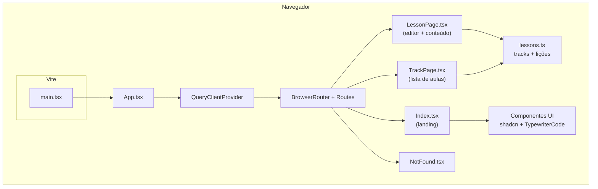

# Code Buddy

Aplicação web para aprender programação em **trilhas** (ex.: Python, JavaScript), com **aulas interativas**, editor de código na página e feedback por saída esperada. Interface em React, dados das lições em TypeScript (sem backend neste repositório).

---

## Requisitos

| Requisito | Versão / notas |
|-----------|----------------|
| **Node.js** | **20 LTS** ou superior (recomendado; compatível com Vite 5 e TypeScript 5.8) |
| **npm** | Incluído com o Node; use `npm ci` ou `npm install` conforme o fluxo abaixo |
| **Navegador** | Chrome, Edge, Firefox ou Safari recentes (ES modules + APIs modernas) |

Opcional:

- **Bun** — existe `bun.lock` no histórico do projeto; o fluxo principal documentado usa **npm** e `package-lock.json`.

Variáveis de ambiente: **não são obrigatórias** para desenvolvimento local; não há API externa configurada no código base das lições.

---

## Como executar

```bash
# Instalar dependências
npm install

# Servidor de desenvolvimento (porta padrão do Vite neste projeto: 8080)
npm run dev
```

Abre `http://localhost:8080` (ou o URL indicado no terminal).

Outros scripts úteis:

| Comando | Descrição |
|---------|-----------|
| `npm run build` | Build de produção em `dist/` |
| `npm run preview` | Servir o build localmente |
| `npm run lint` | ESLint no projeto |
| `npm test` | Vitest (testes unitários) |

---

## Linguagens e tecnologias

### Linguagens de programação (código-fonte)

| Linguagem | Uso no projeto |
|-----------|----------------|
| **TypeScript** | Toda a aplicação (`*.ts`, `*.tsx`) |
| **CSS** | Estilos globais e utilitários (`index.css`, Tailwind) |

### Conteúdo pedagógico (trilhas)

As lições no ficheiro `src/data/lessons.ts` ensinam principalmente **Python** e **JavaScript** (exemplos e templates de código nos exercícios).

### Stack principal

| Tecnologia | Função |
|------------|--------|
| **React 18** | UI e componentes |
| **Vite 5** | Dev server e bundler |
| **React Router 6** | Rotas (`/`, `/trilha/:trackId`, `/trilha/:trackId/aula/:lessonId`) |
| **Tailwind CSS 3** | Estilização utilitária |
| **shadcn/ui** (Radix) | Componentes acessíveis em `src/components/ui/` |
| **Framer Motion** | Animações (ex.: componente de código na landing) |
| **TanStack Query** | Cliente de dados/cache (preparado para evoluções) |
| **Zod** + **React Hook Form** | Formulários e validação (onde aplicável) |
| **Vitest** + **Testing Library** | Testes |

---

## Diagrama (visão de arquitetura)

Fluxo lógico da aplicação no browser: SPA estática, dados em módulo TypeScript.



Resumo:

- **Sem servidor de API** neste repo: trilhas e lições vêm de **`src/data/lessons.ts`**.
- **Rotas** concentram-se em `App.tsx`; páginas em `src/pages/`.
- **Design system** em `src/components/ui/` (Radix + Tailwind).

---

## Estrutura de pastas (resumo)

```
src/
  App.tsx           # Rotas e providers globais
  main.tsx          # Entrada React
  pages/            # Index, TrackPage, LessonPage, NotFound
  data/lessons.ts   # Dados das trilhas e lições
  components/       # UI partilhada + TypewriterCode, NavLink
  components/ui/  # shadcn / Radix
  hooks/            # Hooks reutilizáveis
  lib/utils.ts      # Utilitários (ex.: cn)
```

---

## Licença e origem

Projeto desenvolvido com apoio de ferramentas de geração de UI (ex.: Lovable); o código é teu para evoluir, testar e publicar conforme a tua licença escolhida (este repositório não define `LICENSE` por defeito — podes adicionar uma).

---

## Ligações

- Repositório: [github.com/Costanza22/code-buddy-76](https://github.com/Costanza22/code-buddy-76)
